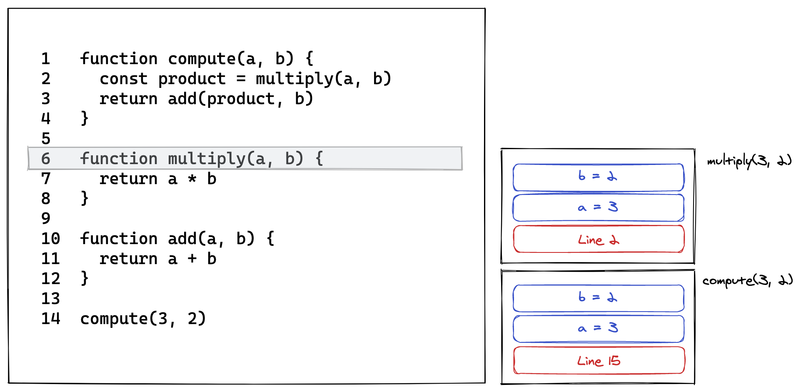

Potential call stack visualization:



Example code:

```js
function compute(a, b) {
    const product = multiply(a, b)
    return add(product, b)
}

function multiply(a, b) {
    return a * b
}

function add(a, b) {
    return a + b
}

compute(3, 2)
```

I want to change the above code into a series of stack activations, something like:

```js
/* compute(3, 2) */
let stack = [
    {
        name: 'compute',
        arguments: [
            ['a', 3],
            ['b', 2]
        ],
        returnAddress: 15
    }
]

/* const product = multiply(a, b) */
stack = [
    {
        name: 'compute',
        arguments: [
            ['a', 3],
            ['b', 2]
        ],
        returnAddress: 15
    },
    {
        name: 'multiply',
        arguments: [
            ['a', 3],
            ['b', 2]
        ],
        returnAddress: 2
    }
]

/* const product = 6 */
stack = [
    {
        name: 'compute',
        arguments: [
            ['a', 3],
            ['b', 2]
        ],
        returnAddress: 15,
        localVars: [
            ['product', 6]
        ]
    }
]

/* add(product, b) */
stack = [
    {
        name: 'compute',
        arguments: [
            ['a', 3],
            ['b', 2]
        ],
        returnAddress: 15,
        localVars: [
            ['product', 6]
        ]
    },
    {
        name: 'add',
        arguments: [
            ['a', 6],
            ['b', 2]
        ],
        returnAddress: 3
    }
]

/* return 8 */
stack = [
    {
        name: 'compute',
        arguments: [
            ['a', 3],
            ['b', 2]
        ],
        returnAddress: 15,
        localVars: [
            ['product', 6]
        ]
    },
]

/* halt */
stack = []
```
